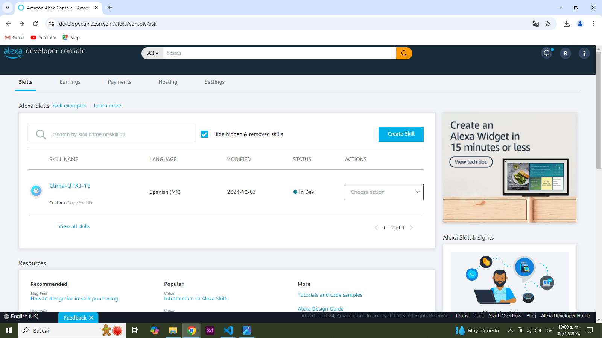

# Skill-Clima---Alexa---210714

## HISTORIAL DE PRACTICAS
|No.|Nombre|Potenciador|Estatus|
|--|--|--|--|
|26|Creacion de skill de alexa|Pendiente|⭐Activa|

## **Documentación**
---
<h1>UNIVERSIDAD TECNOLÓGICA DE XICOTEPEC DE JUÁREZ</h1>
<div style="display: flex; justify-content: space-between;">
    
    
</div>
<br><br><br><br><br><br><br><br><br><br>

<div style="text-align: center;">    
    <p><strong>Materia:</strong> Desarrollo Móvil Integral</p>
    <p><strong>Alumno:</strong> </p>
    <p><strong>Matricula:</strong> 210714</p>
    <p><strong>10 A - IDGS</strong></p>
</div>

**Practica 26:** Creacion de una Alexa Skill  
**Objetivo:** Desarrollar una Skill en Amazon developer para consumir el API del clima de OpenWeather

**Codigo**
```bash
const Alexa = require('ask-sdk-core');
const axios = require('axios');

const LaunchRequestHandler = {
  canHandle(handlerInput) {
    return Alexa.getRequestType(handlerInput.requestEnvelope) === 'LaunchRequest';
  },
  handle(handlerInput) {
    const speakOutput = 'Esta skill esta hecha por Romualdo Perez, ¿Qué quieres hacer?';
    return handlerInput.responseBuilder
      .speak(speakOutput)
      .reprompt(speakOutput)
      .getResponse();
  }
};

const WeatherIntentHandler = {
  canHandle(handlerInput) {
    return (
      Alexa.getRequestType(handlerInput.requestEnvelope) === 'IntentRequest' &&
      Alexa.getIntentName(handlerInput.requestEnvelope) === 'Clima'
    );
  },
  async handle(handlerInput) {
    try {
      const apiKey = '7ac18520fac41a035b398e8e7d8b61cf'; // Reemplaza con tu clave de API de OpenWeatherMap
      const lat = 19.050; // Reemplaza con la latitud deseada
      const lon = -98.200; // Reemplaza con la longitud deseada
      const response = await axios.get(`https://api.openweathermap.org/data/2.5/weather?lat=${lat}&lon=${lon}&appid=${apiKey}&units=metric&lang=es`);
      const temperature = response.data.main.temp;
      const weatherDescription = response.data.weather[0].description;
      const location = response.data.name;
      const humedad = response.data.main.humidity;
      const tem_max = response.data.main.temp_min;
      //NUEVO
      const sepone = response.data.sys.sunset;
      const sunsetDate = new Date(sepone);
      const sunsetHour = sunsetDate.getHours();
      const sunsetMinutes = sunsetDate.getMinutes();
      const speakOutput = `La temperatura actual en ${location} es de ${temperature} grados Celsius y la humedad es de ${humedad} y el sol se oculta a las ${sunsetHour}:${sunsetMinutes}.`;
      return handlerInput.responseBuilder.speak(speakOutput).getResponse();
    } catch (error) {
      console.log('Error al obtener el clima:', error);
      const speakOutput = 'Lo siento, no pude obtener la información del clima en este momento.';
      return handlerInput.responseBuilder.speak(speakOutput).getResponse();
    }
  },
};

const HelpIntentHandler = {
  canHandle(handlerInput) {
    return (
      Alexa.getRequestType(handlerInput.requestEnvelope) === 'IntentRequest' &&
      Alexa.getIntentName(handlerInput.requestEnvelope) === 'AMAZON.HelpIntent'
    );
  },
  handle(handlerInput) {
    const speakOutput = 'Puedes preguntarme sobre el clima diciendo: ¿Cuál es el clima actual?';
    return handlerInput.responseBuilder.speak(speakOutput).getResponse();
  },
};

const CancelAndStopIntentHandler = {
  canHandle(handlerInput) {
    return (
      Alexa.getRequestType(handlerInput.requestEnvelope) === 'IntentRequest' &&
      (Alexa.getIntentName(handlerInput.requestEnvelope) === 'AMAZON.CancelIntent' ||
        Alexa.getIntentName(handlerInput.requestEnvelope) === 'AMAZON.StopIntent')
    );
  },
  handle(handlerInput) {
    const speakOutput = '¡Hasta luego!';
    return handlerInput.responseBuilder.speak(speakOutput).getResponse();
  },
};

const FallbackIntentHandler = {
  canHandle(handlerInput) {
    return (
      Alexa.getRequestType(handlerInput.requestEnvelope) === 'IntentRequest' &&
      Alexa.getIntentName(handlerInput.requestEnvelope) === 'AMAZON.FallbackIntent'
    );
  },
  handle(handlerInput) {
    const speakOutput = 'Lo siento, no puedo ayudarte con eso. Por favor, inténtalo de nuevo.';
    return handlerInput.responseBuilder.speak(speakOutput).getResponse();
  },
};

const SessionEndedRequestHandler = {
  canHandle(handlerInput) {
    return Alexa.getRequestType(handlerInput.requestEnvelope) === 'SessionEndedRequest';
  },
  handle(handlerInput) {
    console.log(`Sesión terminada: ${JSON.stringify(handlerInput.requestEnvelope)}`);
    return handlerInput.responseBuilder.getResponse();
  },
};

const IntentReflectorHandler = {
  canHandle(handlerInput) {
    return Alexa.getRequestType(handlerInput.requestEnvelope) === 'IntentRequest';
  },
  handle(handlerInput) {
    const intentName = Alexa.getIntentName(handlerInput.requestEnvelope);
    const speakOutput = `Acabas de activar la intención ${intentName}.`;
    return handlerInput.responseBuilder.speak(speakOutput).getResponse();
  },
};

const ErrorHandler = {
  canHandle() {
    return true;
  },
  handle(handlerInput, error) {
    console.log(`Error manejado: ${JSON.stringify(error)}`);
    const speakOutput = 'Lo siento, hubo un problema al procesar tu solicitud. Por favor, inténtalo de nuevo.';
    return handlerInput.responseBuilder.speak(speakOutput).getResponse();
  },
};

exports.handler = Alexa.SkillBuilders.custom()
  .addRequestHandlers(
    LaunchRequestHandler,
    WeatherIntentHandler,
    HelpIntentHandler,
    CancelAndStopIntentHandler,
    FallbackIntentHandler,
    SessionEndedRequestHandler,
    IntentReflectorHandler
  )
  .addErrorHandlers(ErrorHandler)
  .lambda();

```
**interactionModel.json**
```bash
{
    "interactionModel": {
        "languageModel": {
            "invocationName": "clima romualdo",
            "intents": [
                {
                    "name": "AMAZON.CancelIntent",
                    "samples": []
                },
                {
                    "name": "AMAZON.HelpIntent",
                    "samples": []
                },
                {
                    "name": "AMAZON.StopIntent",
                    "samples": []
                },
                {
                    "name": "Clima",
                    "slots": [],
                    "samples": [
                        "hara sol hoy",
                        "va a llover",
                        "dame el clima",
                        "hola",
                        "como estás",
                        "di hola mundo",
                        "di hola",
                        "hola mundo"
                    ]
                },
                {
                    "name": "AMAZON.NavigateHomeIntent",
                    "samples": []
                }
            ],
            "types": []
        }
    }
}

```

***Imagenes***
<div style="display: flex; justify-content: space-between;">
    
    
</div>
<div style="display: flex; justify-content: space-between;">
    
    
</div>
<div style="display: flex; justify-content: space-between;">
    
    
</div>
<div style="display: flex; justify-content: space-between;">
    
    
</div>
